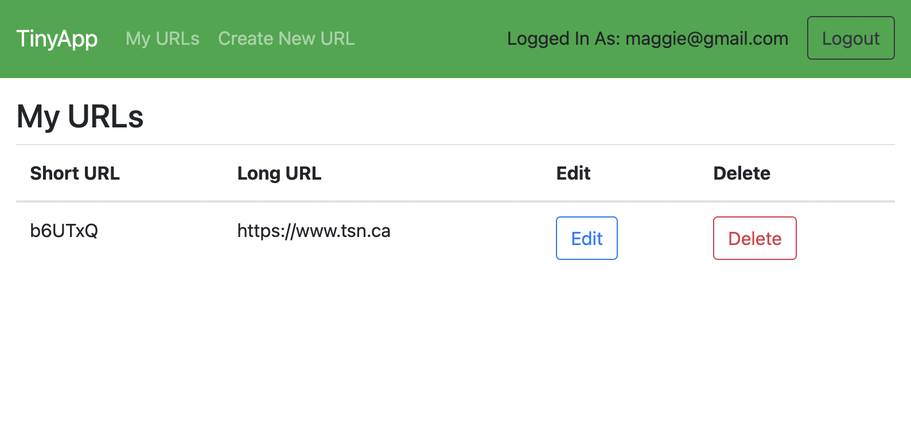
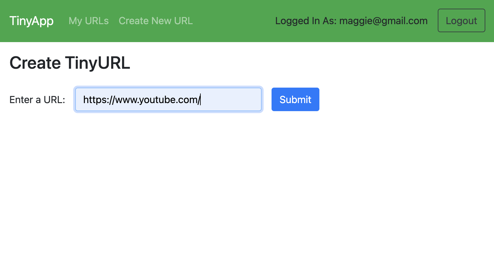
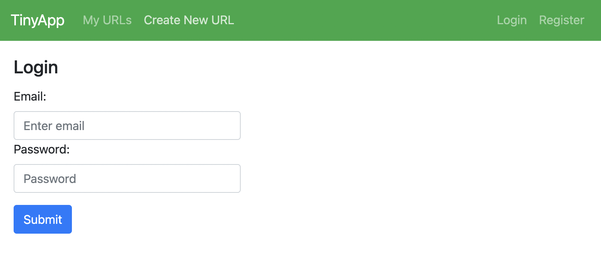

# TinyApp Project

TinyApp is a full stack web application built with Node and Express that allows users to shorten long URLs (à la bit.ly).

## Final Product

## Dependencies

- Node.js
- Express
- EJS
- bcrypt
- body-parser
- cookie-session

## Getting Started

- Install all dependencies (using the `npm install` command).
- Run the development web server using the `node express_server.js` or `npm start` command.
- You can start by accessing the [http://localhost:8080/](http://localhost:8080/).

## Functionalities
- The header or navbar have links which will allow you to check your URLs collection and create/edit the existing ones. Please note, you must be logged in to perform these actions.
- If you are not registered, you can also create one by providing your email and password. Do not worry, your information such as password is hashed and your cookies are encrypted!
- Have fun creating new short URLs =)

